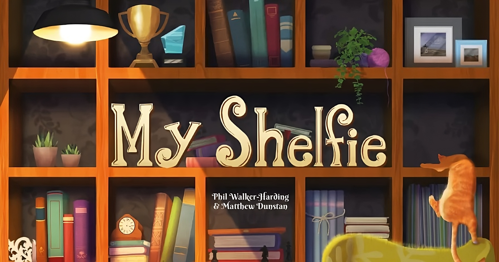

# 
 Andrea Sgobbi, Roberto Scardia, Jonatan Sciaky, Luca Simei 

This is the final project for the Software Engineering course @ Politecnico di Milano.
Objective of this project is to build a distributed version of the game MyShelfie by 
Cranio Creations using a Model-View-Controller architecture.
